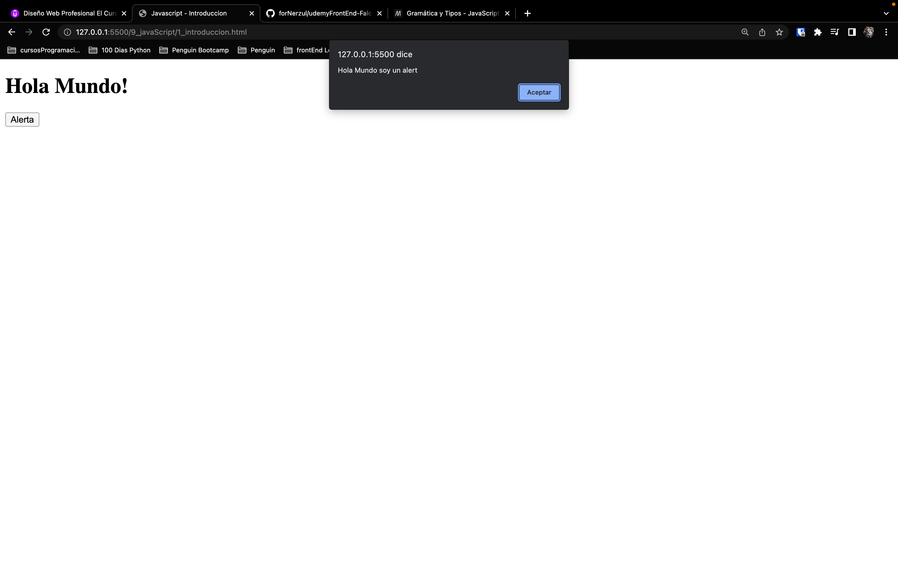
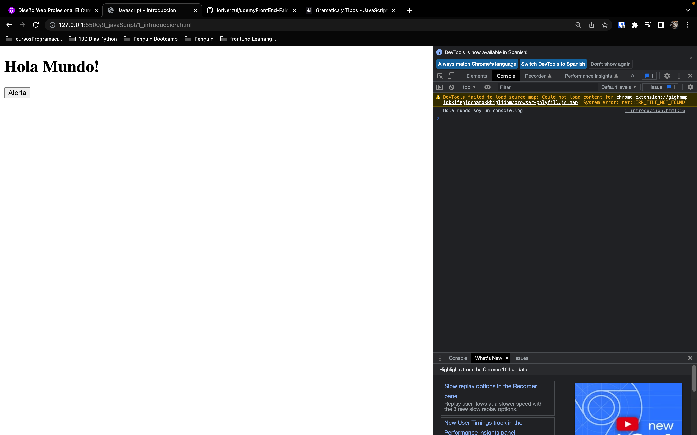
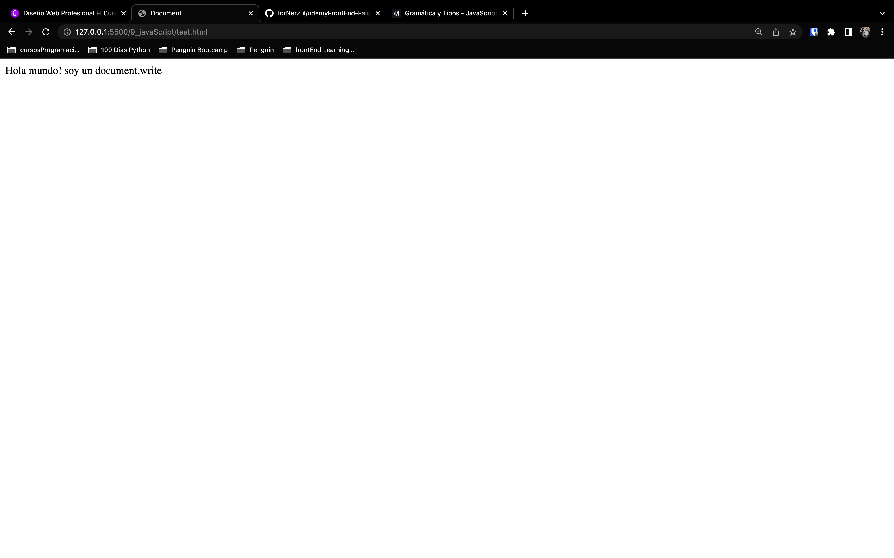

# Fundamentos de JavaScript
- [Fundamentos de JavaScript](#fundamentos-de-javascript)
  - [Introducción](#introducción)
    - [Empezamos con JavaScript](#empezamos-con-javascript)
  - [Variables](#variables)
  - [Metodos de visualizacion de informacion](#metodos-de-visualizacion-de-informacion)
    - [Funcion `alert()`](#funcion-alert)
    - [Funcion `console.log()`](#funcion-consolelog)
    - [Funcion `document.write()`](#funcion-documentwrite)
  - [Tipos de datos](#tipos-de-datos)
  - [Operadores](#operadores)
    - [Operador de asignación](#operador-de-asignación)
    - [Operadores aritméticos](#operadores-aritméticos)
      - [Suma y Concatenación](#suma-y-concatenación)
      - [Resta](#resta)
      - [Multiplicación](#multiplicación)
      - [División](#división)
      - [Modulo](#modulo)
      - [Exponenciacion](#exponenciacion)
    - [Operadores de incremento y decremento](#operadores-de-incremento-y-decremento)
      - [Incremento](#incremento)
      - [Decremento](#decremento)
    - [Operadores logicos y de comparacion](#operadores-logicos-y-de-comparacion)
      - [Operador igual a](#operador-igual-a)
## Introducción
Teniendo en cuenta que `HTML` es un lenguaje de enmarcado que nos va a servir para dar estructura a la informacion que queremos presentar mediante una pagina web y que `CSS` nos ayuda a dar estilos a esa informacion de tal forma que podamos mostrar de una forma estetica y maquetar nuestra web, `JavaScript` es un lenguaje de programación que se puede usar para volver interactiva nuestra web, con `JavaScript` podemos agruegar logica y dinamismo a nuestro contenido del lado del cliente, agregar botones, validar formularios, cambiar el color de texto, el color de fondo, y muchas cosas mas, basicamente sin `JavaScript` nuestra web seria estatica y no podriamos cambiar el contenido.

### Empezamos con JavaScript
Lo primero que debemos hacer es crear un archivo `HTML` con la estructura basica para hacer el llamado de javscript, para lo cual tendremos 2 formas de trabajar:

* Mediante el uso de la etiqueta `<script>`:
    
```html 
<!DOCTYPE html>
<html lang="en">
<head>
    <title>Document</title>
</head>
<body>
    <!-- Aqui va nuestro codigo html --> 

<script>
    // Aqui va el codigo de JavaScript
    alert("Hola mundo");
</script>
</body>
</html>
```
* Mediante el uso de la etiqueta `<script>` pero utilizando el atributo `src`:  
    Ejemplo: `<script src="js/script.js"></script>`
```html 
<!DOCTYPE html>
<html lang="en">
<head>
    <script src="js/script.js"></script>
    <title>Document</title>
</head>
<body>
<!-- Aqui va nuestro codigo html --> 
</body>
</html>
```
## Variables
Las variables son contenedores en donde guardamos informacion que podemos utilizar en nuestro codigo de JavaScript. 

Para crear una variable debemos utilizar la palabra reservada `var` (existen otro tipo de variables en las cuales utilizaremos `let` o `const`) y luego el nombre de la variable, para asignarle un valor a la variable debemos utilizar la palabra reservada `=` y luego el valor que queremos asignarle a la variable.  
Ej.:
```javascript
// Creacion y asignacion de una variable
var nombre = "Juan";
```
Ademas podemos hacerlo en 2 fases, la primera es crear la variable y la segunda es asignarle un valor a la variable.

```javascript
// creacion de la variable
var nombre;
// asignacion de la variable
nombre = "Juan";
```

Tambien podemos crear varias variables en una sola linea, para lo cual utilizaremos la palabra reservada `var` y luego el nombre de la variable y luego una coma y luego el nombre de otras variables y asignar su valor posteriormente.

```javascript
// creacion de variables
var nombre, apellido;
// asignacion de valores a las variables
nombre = "Juan";
apellido = "Perez";
```

## Metodos de visualizacion de informacion
A continuacion veremos los metodos de visualizacion de informacion de las variables que podemos utilizar para mostrar informacion en nuestra pagina web, o `consola` del `JavaScript`.

### Funcion `alert()`
La funcion `alert()` nos permite mostrar un mensaje en una ventana emergente.

```javascript
var variable = "Hola mundo soy un alert";
alert(variable);
```
Esto se ve asi:


### Funcion `console.log()`
La funcion `console.log()` nos permite mostrar un mensaje en la consola del navegador.

```javascript
var variable = "Hola mundo soy un console.log";
console.log(variable);
```
Esto se ve asi:


### Funcion `document.write()`
La funcion `document.write()` nos permite mostrar un mensaje en la pagina web escribiendo directamente en el `HTML`.

```javascript
var variable = "Hola mundo soy un document.write";
document.write(variable);
```
Esto se ve asi:


## Tipos de datos
Los tipos de datos que podemos utilizar en JavaScript son:
  - Numericos
  - Cadenas de texto
  - Arreglos
  - Funciones
  - Booleanos
  - Objetos

```html 
<!DOCTYPE html>
<html lang="en">
<head>
    <title>Document</title>
</head>
<body>
<!-- Aqui va nuestro codigo html -->
<script>
    var numero = 7; // variable numerica
    var decimal = 7.5; // variable numerica decimal

    var cadena = "Hola"; // variable cadena de texto
    var cadena2 = '5'; // variable cadena de texto conteniendo un numero

    var arreglo = [1,2,3,4,5]; // variable arreglo

    var saludo = function(){ 
            console.log("Hola");
    } // variable funcion

    booleano = true; // variable booleana

    objeto = {
        nombre: "Juan",
        apellido: "Perez",
        edad: 25
    }; // variable objeto
</script>   
</body>
</html>
```

## Operadores
Los operadores son un conjunto de funciones que nos permiten realizar operaciones matematicas, logicas, etc.
- Asignación
- Matemáticos o aritméticos
- Incremento y decremento
- Operadores lógicos y de comparación

### Operador de asignación
El operador de asignación es el `=` y nos permite asignar un valor a una variable.

```javascript
var numero = 7;
```
### Operadores aritméticos
Los operadores aritméticos son los siguientes:
- Suma
- Resta
- multiplicación
- división
- modulo

#### Suma y Concatenación
El operador de suma es el `+` y nos permite sumar dos variables.  
Si sumamos 2 variables de tipo numerico, el resultado sera una variable de tipo numerico con el valor de la suma de ambas variables.  
Si sumamos 2 variables de tipo cadena de texto, el resultado sera una variable de tipo cadena de texto con el valor de la concatenacion de ambas variables.

```javascript
var numero1 = 7;
var numero2 = 5;
var suma = numero1 + numero2; // suma de las variables
```
> El resultado de la suma es `12`

> **_NOTA:_**  Solo podemos sumar variables con valores numericos ya sean enteras o decimales entre si, no podemos sumar una variable numerica con una cadena de texto.  
> Lo que si podemos hacer es sumar una variable de cadena de texto con otra variable de cadena de texto. A esto se le conoce como concatenación de cadenas de texto.

Ejemplo de concatenación de cadenas de texto:

```javascript
var nombre = "Juan"; // variable cadena de texto
var apellido = "Perez"; // variable cadena de texto
var nombreCompleto = nombre + " " + apellido; // concatenacion de cadenas de texto
```
> El resultado de la concatenación es `Juan Perez`

```javascript
var numero1 = "7"; // variable cadena de texto
var numero2 = "5"; // variable cadena de texto
var suma = numero1 + numero2; // concatenacion de cadenas de texto
```
> El resultado de la suma es `75` debido a la concatenacion (el resultado es una cadena de texto)

#### Resta
El operador de resta es el `-` y nos permite restar dos variables.  
No podemos restar una variable de tipo cadena de texto con una variable de tipo numerica, ni restar cadenas de texto entre si.

```javascript
var numero1 = 7; // variable numerica
var numero2 = 5; // variable numerica
var resta = numero1 - numero2; // resta de las variables
```
> El resultado de la resta es `2`

#### Multiplicación
El operador de multiplicación es el `*` y nos permite multiplicar dos variables.
```javascript
var numero1 = 7; // variable numerica
var numero2 = 5; // variable numerica
var multiplicacion = numero1 * numero2; // multiplicacion de las variables
```
> El resultado de la multiplicación es `35`

#### División
El operador de división es el `/` y nos permite dividir dos variables.
```javascript
var numero1 = 7; // variable numerica
var numero2 = 5; // variable numerica
var division = numero1 / numero2; // division de las variables
```
> El resultado de la division es `1.2`

#### Modulo
El operador de modulo es el `%` y nos permite obtener el residuo de una division.
```javascript
var numero1 = 7; // variable numerica
var numero2 = 5; // variable numerica
var modulo = numero1 % numero2; // modulo de las variables
```
> El resultado de la modulo es `2`

#### Exponenciacion
El operador de exponenciacion es el `**` y nos permite elevar una variable a una potencia.
```javascript
var numero1 = 7; // variable numerica
var numero2 = 5; // variable numerica
var exponenciacion = numero1 ** numero2; // exponenciacion de las variables
```
> El resultado de la exponenciacion es `16807`

### Operadores de incremento y decremento
Los operadores de incremento y decremento son los siguientes:
#### Incremento
El operador de incremento es el `++` y nos permite incrementar una variable en uno.  

Tenemos 2 formas de incrementar una variable:
- Preincremento
```javascript
var numero = 7; // variable numerica
incremento = ++numero; // preincremento de la variable
console.log(incremento); // imprimimos el resultado de la operacion
```
> El resultado de la variable incremento es `8` debido a que al escribir `incremento = ++numero` la variable numero aumenta en uno antes de asignar el valor a la variable `incremento`.
- Posincremento
```javascript
var numero = 7; // variable numerica
incremento = numero++; // posincremento de la variable
console.log(incremento); // imprimimos el resultado de la operacion
console.log(numero); // imprimimos el resultado de la operacion
```
> El resultado de la variable incremento es `7` debido a que al escribir `incremento = numero++` la variable numero aumenta en uno despues de asignar el valor a la variable `incremento`.  
> si hacemos `console.log(numero);` el resultado es `8` debido a que al escribir `numero++` la variable numero aumenta en uno despues de asignar el valor a la variable `incremento`.
#### Decremento
El operador de decremento es el `--` y nos permite decrementar una variable en uno.  
Los mismos principios del operador de incremento se aplican al operador de decremento.
- Predecremento
```javascript
var numero = 7; // variable numerica
decremento = --numero; // preincremento de la variable
console.log(decremento); // imprimimos el resultado de la operacion
```
> El resultado de la variable decremento es `6` debido a que al escribir `decremento = --numero` la variable numero decrementa en uno antes de asignar el valor a la variable `decremento`.

- Posdecremento
```javascript
var numero = 7; // variable numerica
decremento = numero--; // posincremento de la variable
console.log(decremento); // imprimimos el resultado de la operacion
console.log(numero); // imprimimos el resultado de la operacion
```
> El resultado de la variable decremento es `7` debido a que al escribir `decremento = numero--` la variable numero decrementa en uno despues de asignar el valor a la variable `decremento`.  
> Si hacemos `console.log(numero);` el resultado es `6` debido a que al escribir `numero--` la variable numero decrementa en uno despues de asignar el valor a la variable `decremento`.

### Operadores logicos y de comparacion
Los operadores logicos son los siguientes:
#### Operador igual a
El operador igual a es el `==` y nos permite comparar dos variables su resultado puede ser `true` o `false`.
```javascript
var numero1 = 7; // variable numerica
var numero2 = 5; // variable numerica
var igual = numero1 == numero2; // igual a las variables
console.log(igual); // imprimimos el resultado de la operacion
```
> El resultado de la comparacion es `false` debido a que las variables no son iguales por que 5 no es igual a 7.

```javascript
var numero1 = 7; // variable numerica
var numero2 = "7"; // variable cadena de texto
var igual = numero1 == numero2; // igual a las variables
console.log(igual); // imprimimos el resultado de la operacion
```
> El resultado de la comparacion es `true` debido a que las variables son iguales por que "7" es igual a 7. Esto nos indica que incluso si las variables son de tipo cadena de texto, pueden ser comparadas con numericas.


